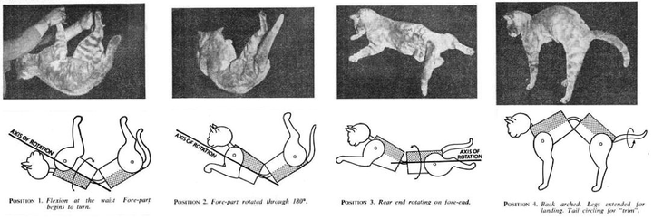

# Physics-Based Cat Righting Reflex Simulation
**A Vector Dynamics Approach using Quaternions & Rigid Body Physics**

**Author:** Ada Tsan Qin  
**Date:** December 2025

---

## 1. Introduction

### Motivation
The primary motivation of this project is to simulate the **Cat Righting Reflex**—the ability of cats to land on their feet when falling upside down—using rigorous **Rigid Body Dynamics**.

Unlike simple geometric animations that "hard-code" rotation angles, this project builds a physics solver. It demonstrates how complex 3D reorientation (tumbling) naturally emerges from the conservation of the angular momentum vector ($\vec{L}$), without external torques.

This project demonstrates perticularly how **Quaternion** can help the simulation and visualization of **complex rotation dynamics** in a near-real situation.

### AI-Aided Development
This project represents an **AI-Aided Software Engineering (AIASE)** workflow. The code evolved through multiple iterations—from a basic scalar model to a full vector physics engine—demonstrating how physical concepts can be iteratively refined into executable Python code.

---

## 2. Physics Framework: From Scalar to Vector

The simulation creates a non-rigid multi-body system consisting of a front body and a back body connected by a flexible spine.

### 2.1 The Vector Conservation Law
In a free fall, the total angular momentum must remain zero.
$$ \vec{L}_{total} = \vec{L}_{internal} + \vec{L}_{base} = \vec{0} $$

* **$\vec{L}_{internal}$ (Action)**: Generated by the cat's internal deformations (twisting spine, retracting/extending legs).
* **$\vec{L}_{base}$ (Reaction)**: The whole-body rotation required to cancel the internal momentum.

The solver computes the base angular velocity $\vec{\omega}_{base}$ at every frame:
$$ \vec{\omega}_{base} = -\mathbf{I}_{sys}^{-1} \cdot \vec{L}_{internal} $$
Where $\mathbf{I}_{sys}$ is the instantaneous inertia tensor of the deformed body.

### 2.2 The "Emergent" Tumbling
Previously, animations might manually animate the cat flipping over. In this simulation, **we do not program the flip**.
We only program the internal shape changes (bending + twisting). The global flip (precession) is a mathematical consequence of the conservation law.


*Figure 1: The theoretical model of spinal flexion and torsional reorientation.*

---

## 3. Quaternion Mechanics & Implementation

This project relies heavily on **Unit Quaternions** ($q \in S^3$) to handle the complex 3D transformations. Quaternions offer numerical stability and avoid the **Gimbal Lock** singularities inherent in Euler angles, which is critical when the cat's body bends and twists simultaneously.

### 3.1 Composition of Local Shapes
The "shape" of the cat is defined by two local rotations relative to the spine: **Bending** ($\beta$, Pitch) and **Twisting** ($\phi$, Roll).
Using quaternions, we compose these rotations without ambiguity. The local rotation quaternion $q_{local}$ for each body segment is calculated as:

$$ q_{local} = q_{bend}(\beta) \otimes q_{twist}(\phi) $$

Where $\otimes$ denotes quaternion multiplication. In the code (`scipy.spatial.transform`), this corresponds to:
```python
r_local = R.from_euler('y', bend) * R.from_euler('x', twist)
```

### 3.2 Tensor Transformation
The Moment of Inertia Tensor ($\mathbf{I}$) is defined in the body's local frame. To solve the conservation equation in the global frame, we must rotate this tensor.
Using the rotation matrix $R$ derived from the quaternion $q_{local}$:

$$ \mathbf{I}_{global} = R \cdot \mathbf{I}_{local} \cdot R^T $$

This allows us to sum the inertia tensors of the front and back halves correctly, even when the cat is bent into a "U" shape.

### 3.3 Time Integration of Angular Velocity
The physics solver outputs an instantaneous angular velocity vector $\vec{\omega}_{base}$. To update the cat's global orientation over time, we perform quaternion integration.
Instead of adding Euler angles (which is mathematically incorrect for 3D rotations), we apply a differential rotation quaternion:

$$ q_{global}(t+\Delta t) = \Delta q(\vec{\omega}_{base} \Delta t) \otimes q_{global}(t) $$

This ensures the cat's tumbling motion is smooth, accurate, and mathematically rigorous.

---

## 4. Visual Implementation Features

To enhance realism and perception:

* **Free Fall Environment**: A dynamic ground grid accelerates upwards ($h = \frac{1}{2}gt^2$), simulating the rush of gravity.
* **Visual-Physics Decoupling**: Physically, the cat extends/retracts legs (changing width) to manipulate inertia. Visually, the body width remains constant to maintain aesthetic clarity, while the physics engine uses the "virtual" expanded width.
* **Perspective & Lighting**: Uses perspective projection and light source shading to provide strong depth cues.

---

## 5. Algorithmic Logic (Solver Pseudo-code)

The core logic has shifted from linear interpolation to a differential equation solver:

```text
FUNCTION Update(frame):
    // 1. Kinematics (Shape Change)
    current_bend  = Interpolate(Bend_Sequence)
    current_twist = Interpolate(Spin_Sequence)
    current_width = Calculate_Virtual_Inertia_Width()

    // 2. Construct Local Frames (Quaternions)
    Q_front_local = Bend_F * Twist_F
    Q_back_local  = Bend_B * Twist_B

    // 3. Compute Physics Properties
    Inertia_Tensor = Transform_Inertia_To_Global(current_width)
    L_internal     = I_front * w_front_rel + I_back * w_back_rel

    // 4. Solve for Base Reaction (The "Flip")
    w_base = - Inverse(Inertia_Tensor) * L_internal

    // 5. Integrate Global Pose (Quaternion Integration)
    Global_Orientation += w_base * dt
    Altitude = Initial_Height - 0.5 * g * time^2

    RENDER(Scene)
```
The basic model framework, code structure, and graphic rendering are completed by Gemini3 pro, while the detailed physics, mathematics, parameter fine tuning are manually implemented.

---

## 6. Development Log (Evolution History)

The project evolved through five distinct stages:

* **v1.0 (Scalar Model)**: Simple animation based on $I_1\omega_1 + I_2\omega_2 = 0$. Could only show 1D rotation.
* **v2.0 (Visual Upgrade)**: Added legs and horizontal posture.
* **v3.0 (Geometric Fix)**: Replaced cylinders with **Square Prisms** to fix visual rotation ambiguity. Introduced the "Spine" visualization.
* **v4.0 (Vector Physics)**: **Major Refactor.** Switched to Tensor calculus. The global tumbling became an emergent property. Visuals were decoupled from physics (invisible leg extension).
* **v5.0 (Final Polish)**: Added **Free Fall** dynamics (dynamic ground), optimized bending angles ($40^\circ$ max), and refined the landing pose (arched back).

---

## 7. Execution Results

### 3D Visualization
The animation shows the cat falling from height. It bends, twists its body segments symmetrically, and the entire body magically flips $180^\circ$ to face the ground just before impact.


### Data Analysis (Angular Momentum)
The generated plots validate the physics engine:
* **Red/Blue Lines ($L_{front}, L_{back}$)**: Show large, symmetric oscillations, indicating internal effort.
* **Green/Black Line ($L_{total}$)**: Remains strictly at **Zero**. This proves the cat violates no conservation laws.

---

## 8. Dependencies & Usage

### Requirements
* Python 3.x
* `numpy`, `scipy` (for spatial transformations & linear algebra)
* `matplotlib` (for 3D rendering)

### Run
```bash
python cat_reflex_quaternion.py
```
The script will render the frame-by-frame physics solution and save the result as `cat_reflex_final.gif`.